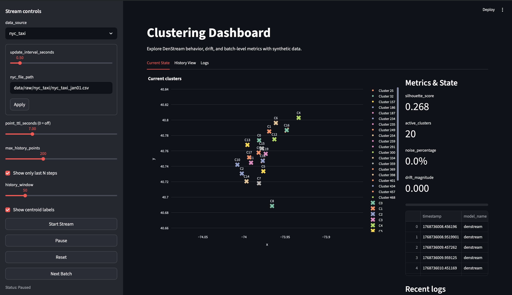
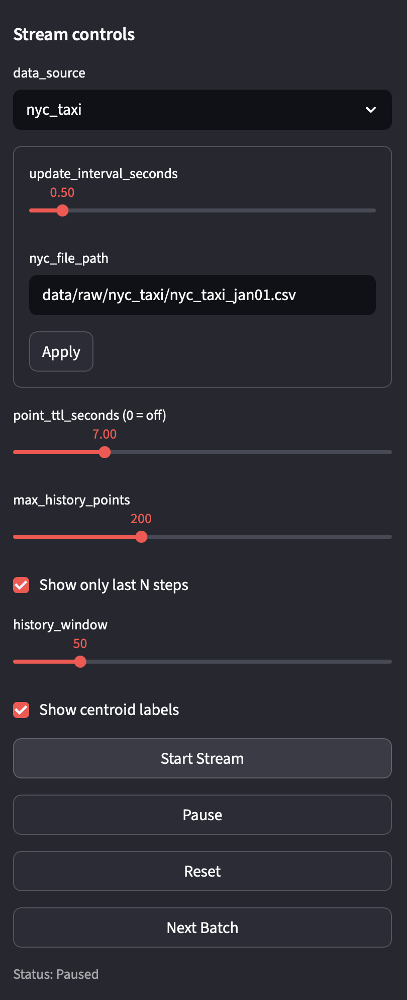
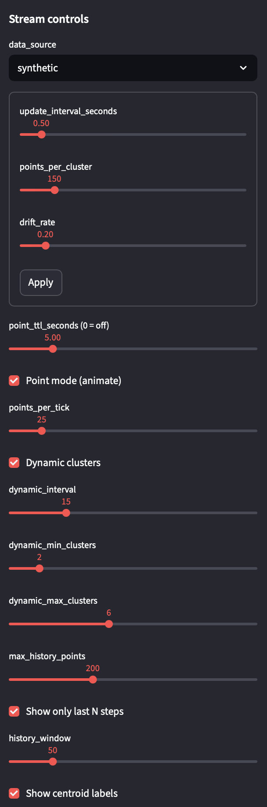
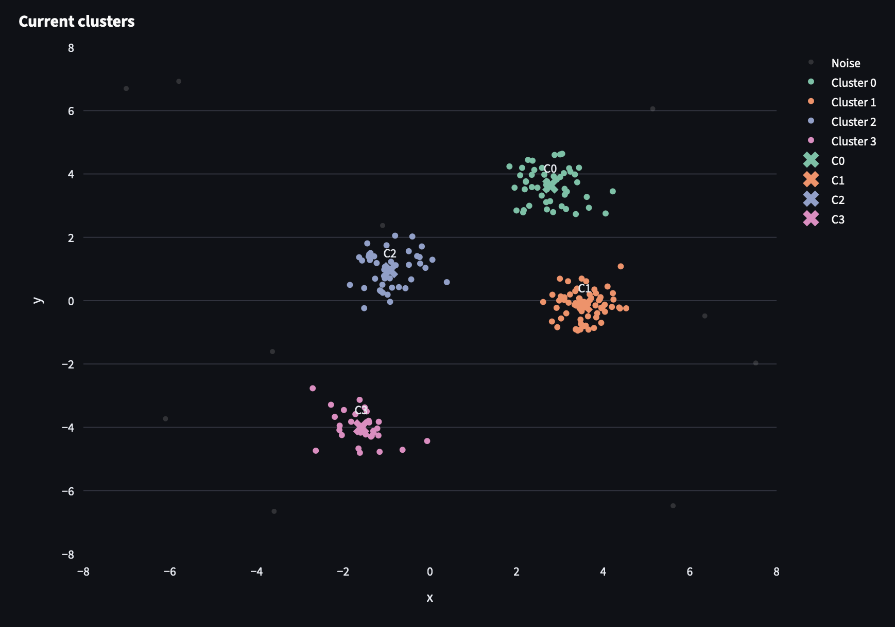
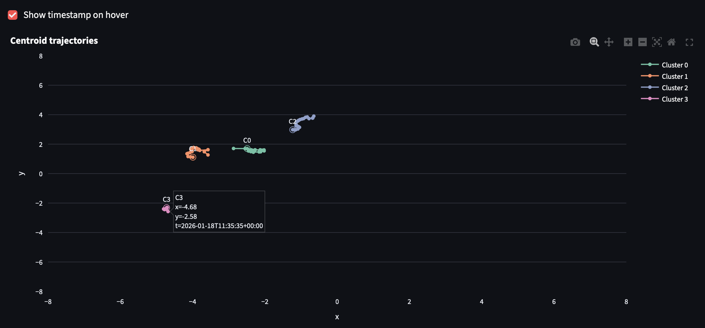
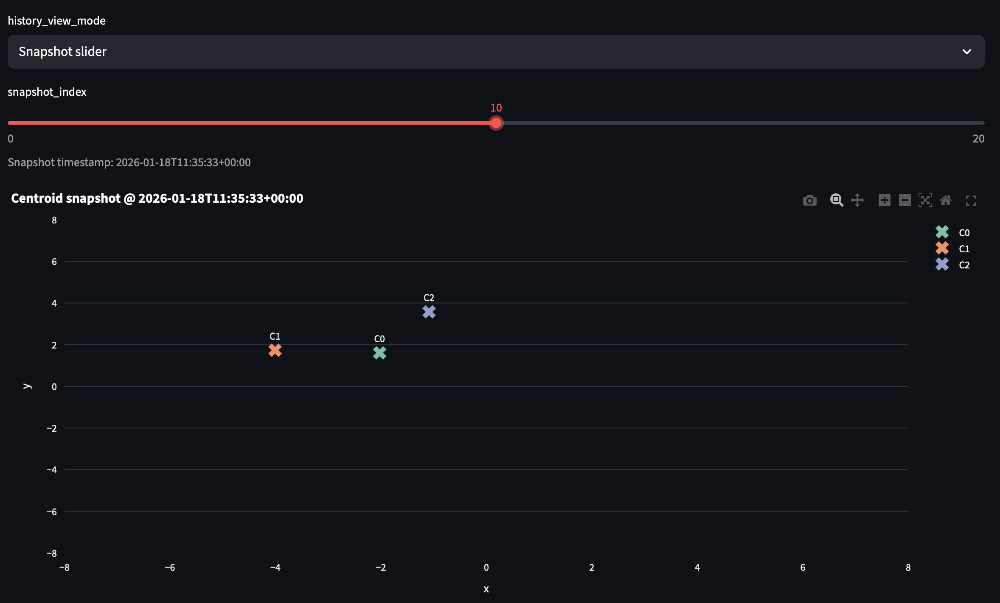
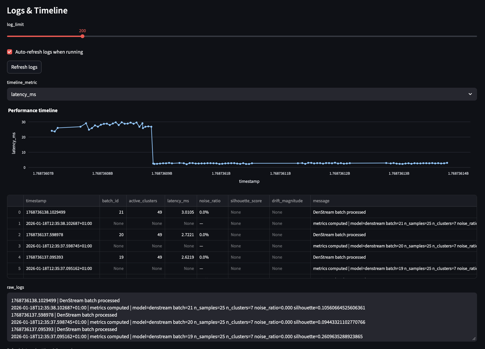

# User Documentation

## Overview
This project provides an interactive clustering dashboard for streaming data. It supports two data sources:

- **NYC Taxi (real data)**: pickup longitude/latitude streamed second by second.
- **Synthetic**: a controlled stream with drift and optional dynamic clusters.

The backend exposes FastAPI endpoints for streaming and clustering. The frontend is a Streamlit dashboard that visualizes live points, cluster evolution, metrics, and logs.



---

## Quick Start (Docker)

### Backend
```bash
make up-backend
```
The API will be available at `http://localhost:8000`.

### Frontend
```bash
make up-frontend
```
Open the dashboard at `http://localhost:8501`.

---

## Quick Start (Local)

### Backend
```bash
make run-backend-local
```

### Frontend
```bash
make run-frontend-local
```

---

## Data Sources

### NYC Taxi (Primary Use Case)
When `data_source = nyc_taxi`:

- The dashboard streams pickup points from a CSV file (default: `data/nyc_taxi/nyc_taxi_jan01.csv`).
- Each tick represents **one second** of data.
- All pickups within that second are returned as points.
- Plot axes are computed from the NYC file bounds (mean ± 3 * std for longitude/latitude).
- Synthetic-only parameters (drift, dynamic clusters) are not used.

This mode is focused on real geographic movement patterns rather than simulated drift.

### Synthetic
When `data_source = synthetic`:

- Points are generated by a drifting synthetic process.
- You can enable **dynamic clusters** to make the number of clusters grow/shrink over time.
- All relevant cluster behavior is controllable from the UI.

This mode is designed for experimentation and controlled demonstrations.

---

## UI Controls

### Stream Controls (Common)
These controls appear for both data sources:

- **data_source**: Choose between `nyc_taxi` and `synthetic`. The rest of the controls change based on this selection.

- **update_interval_seconds**: Refresh interval for auto-streaming. Smaller values make the dashboard update more frequently, but increase CPU load and can reduce responsiveness.
  - Low value (e.g. 0.1) = more fluid animation and faster updates.
  - High value (e.g. 2.0) = slower updates and less CPU usage.

- **point_ttl_seconds (0 = off)**: How long points remain visible on the plot and in local metrics.
  - `0` disables TTL, meaning points stay indefinitely.
  - Small values (e.g. 2–5) make points disappear quickly, highlighting only recent activity.
  - Larger values (e.g. 20–30) show longer histories and denser clouds.

- **max_history_points**: Hard cap on points stored locally. When exceeded, older points are discarded. This prevents unbounded memory growth.

- **Start Stream / Pause / Reset / Next Batch**:
  - **Start Stream**: starts auto-refresh and continuously fetches new data.
  - **Pause**: stops auto-refresh.
  - **Reset**: clears local state and resets the stream at the backend.
  - **Next Batch**: fetches one tick manually (useful for stepping through).

---

### NYC Taxi–Only Controls
Visible only when `data_source = nyc_taxi`:

- **nyc_file_path**: Path to the CSV file with columns:
  - `tpep_pickup_datetime`
  - `pickup_longitude`
  - `pickup_latitude`

This lets you switch to other NYC Taxi extracts without changing code.



---

### Synthetic-Only Controls
Visible only when `data_source = synthetic`:

- **points_per_cluster**: Number of points generated per cluster in each batch.
  - Small value = fewer points, sparser clusters.
  - Large value = denser clusters, smoother metrics.

- **drift_rate**: Magnitude of drift applied to cluster centers over time.
  - Small value (e.g. 0.05) = slow movement, stable clusters.
  - Large value (e.g. 1.0–2.0) = fast movement and unstable centroids.

- **Point mode (animate)**: Changes the update pattern so the stream adds smaller batches each tick.
  - When enabled, the stream behaves like a continuous animation.
  - When disabled, each tick adds a full batch (larger jumps between states).

- **points_per_tick**: Used only when Point mode is enabled.
  - Low value (1–10) = smooth animation but slower accumulation.
  - Higher value (20–100) = faster accumulation but less smooth animation.

- **Dynamic clusters**: Enables automatic creation and removal of clusters over time.
  - When enabled, the stream periodically adds or removes a centroid.
  - This is useful to demonstrate how DenStream reacts to emerging or disappearing structure.

- **dynamic_interval**: How often (in ticks) to add/remove clusters.
  - Small value = frequent cluster changes.
  - Large value = more stable cluster counts.

- **dynamic_min_clusters / dynamic_max_clusters**: Bounds for dynamic cluster count.
  - The stream will never go below `dynamic_min_clusters`.
  - The stream will never exceed `dynamic_max_clusters`.



---

## TTL Behavior (Point Lifetime)
TTL only affects the **frontend visualization and local metrics**, not the backend DenStream model.

- **Synthetic**: TTL is computed using each point’s own timestamp.
- **NYC Taxi**: TTL uses **ingest time** (now), not the historical 2016 timestamps.

Implications:
- If TTL is too small, points vanish quickly and clusters appear tiny or unstable.
- If TTL is large or disabled, points accumulate and clusters look dense or very large.
- TTL does not change DenStream’s internal clustering (that is handled by DenStream’s own decay).

---

## DenStream Parameters
The "DenStream parameters" panel controls the online clustering model. These parameters strongly affect cluster size and stability.

- **decay_factor**: How quickly old micro-clusters fade. Higher values make clusters forget history faster.
  - Low values = long memory, stable clusters.
  - High values = short memory, clusters adapt quickly.

- **epsilon**: Neighborhood radius for merging points into micro-clusters.
  - Larger epsilon = larger, fewer clusters.
  - Smaller epsilon = more, smaller clusters.
  - For NYC Taxi (lon/lat scale), values around 0.01–0.05 are often needed.

- **beta**: Weight threshold for potential vs. outlier micro-clusters.
  - Lower beta makes it harder for micro-clusters to become “potential”, reducing cluster count.
  - Higher beta makes clusters appear more easily.

- **mu**: Minimum weight for a micro-cluster to be considered stable.
  - Larger mu = clusters must accumulate more points to survive.
  - Smaller mu = clusters appear quickly but are less stable.

- **n_samples_init**: Initial number of samples used to bootstrap the model.
  - Larger values = more stable initialization but slower to start producing clusters.
  - Smaller values = quicker startup but potentially noisier clusters.

- **stream_speed**: Affects how fast the model evolves relative to incoming data.
  - Higher values = more frequent updates and faster adaptation.
  - Lower values = more conservative adaptation.

---

## Dashboard Tabs

### Current State
Shows the live cluster scatter plot and current metrics.

**Plot**:
- Points are plotted as lon/lat (NYC Taxi) or synthetic x/y.
- Cluster labels (C0, C1, ...) appear if **Show centroid labels** is enabled.



**Metrics & State**:
- **silhouette_score**: Cluster compactness/separation (higher is better).
- **active_clusters**: Number of clusters detected in current view.
- **noise_percentage**: Percentage of points marked as noise.
- **drift_magnitude**: Average centroid movement between the last two snapshots.

**Recent Logs**:
- Local UI log entries (actions, latency, counts).

---

### History View
Tracks how cluster centroids move over time.

Two modes:

1) **Trajectories**
   - Shows centroid paths for each cluster.
   - Optional hover timestamp per point.

   

2) **Snapshot slider**
   - Scroll through centroid positions at a given timestamp.
   - Useful for inspecting cluster evolution step-by-step.

   

---

### Logs
Displays backend logs and metrics over time.

- Select different series (`latency_ms`, `active_clusters`, `noise_ratio`, etc.).
- Inspect raw log payloads in a text area.



---

## NYC Taxi Workflow (Recommended)
1) Select `data_source = nyc_taxi`.
2) Set `nyc_file_path` to `data/nyc_taxi/nyc_taxi_jan01.csv.csv`.
3) Click **Apply**.
4) Click **Start Stream**.
5) Adjust TTL and DenStream parameters to tune cluster size/behavior.

---

## Synthetic Workflow (Recommended)
1) Select `data_source = synthetic`.
2) Configure `points_per_cluster` and `drift_rate`.
3) Enable **Dynamic clusters** for changing cluster counts.
4) Click **Start Stream**.

---
